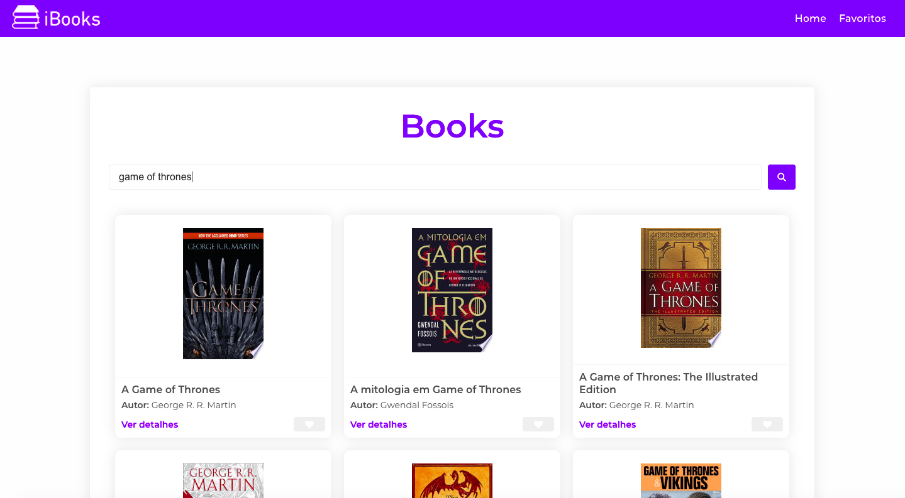
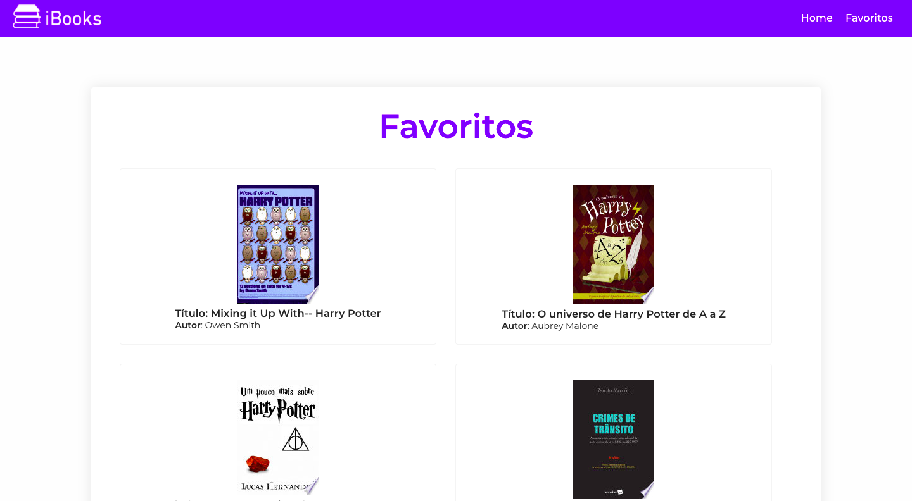

<h1 align="center">
   # iBooks App
</h1>

<p align="center">
  <a href="https://github.com/rebecagrn/ibooks-app/commits/master">
    
  </a>
</p>

### Web Screenshot

<div style="display: flex; flex-direction: 'row'; align-items: 'center';">
   
   
</div>

### Live URL, deployed on Netlify

[ibooks app](https://i-books.netlify.app/).

# :computer: Technologies

This project was made using the follow technologies and libraries:

<ul>
  <li>React</li>
  <li>Styled Components</li>
  <li>React Icons</li>
  <li>React-Router-Dom</li>
  <li>Axios</li>
  <li>Google Books API</li>
</ul>

# :rocket: Features

- App to search and list books
- App to favorite your books.

# :construction_worker: How to run

```bash
# Clone Repository
$ git clone https://github.com/rebecagrn/ibooks-app.git
```

### 💻 Run Web Project

```bash

# Install Dependencies
$ yarn

# Run Application
$ yarn start
```

Developed by [Rebeca](https://rebecadeveloper.netlify.app/) 🚀.

Give me a ⭐️ if this project helped you!
